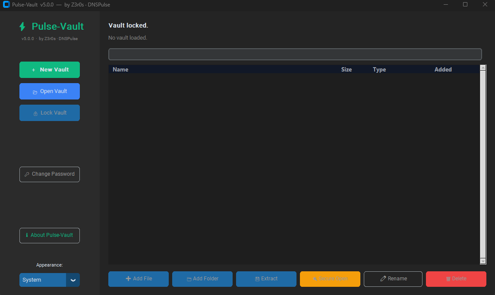

# 🛡️ PulseVault (by DNSPulse)


[](https://python.org)
[](LICENSE)
[](#)
[](#)

**Pulse-Vault** is a next-generation, high-performance encrypted file vault designed by **DNSPulse**. Built to handle massive files securely and quickly, PulseVault creates fully isolated, self-contained local vaults that are completely immune to network tracking.

---

## ✨ Features

- **Military-Grade Cascading Cipher:** Your data is encrypted multiple times sequentially through independent cryptographic algorithms. Even if one algorithm is theoretically broken in the future, your files remain completely inaccessible.
- **Memory-Hard Key Derivation:** We use advanced cryptographic functions that mathematically require massive amounts of RAM to execute. This physically prevents attackers from brute-forcing your password using GPU clusters or ASIC hardware.
- **Auto-Generated Backend Keys:** Implements dynamic internal key management (Key Encryption Keys) for secure data streaming and instantaneous password changing.
- **Zero-Network Architecture:** Fully local execution. No telemetry, no AI plugins, no API keys.
- **Large File Streaming (V3 Container):** Encrypts files as separate blocks within a containerized format, supporting gigabyte-sized files without exhausting system RAM.
- **Modern UI:** Built on `CustomTkinter` for a stunning dark-mode desktop experience.

---

## 🚀 Quick Start

Get PulseVault running instantly on any system:

```bash
git clone https://github.com/z3r0s/pulse-vault.git
cd pulse-vault
pip install -r requirements.txt
python main.py
```

### Parrot OS Native Installer
PulseVault includes a dedicated wrapper script that safely bypasses Debian's `EXTERNALLY-MANAGED` warnings by isolating dependencies, allowing you to launch PulseVault globally.
```bash
chmod +x install_parrot.sh
./install_parrot.sh
pulse-vault
```

---

### Option 2: Build APT / `.deb` Package
PulseVault includes configuration files to compile directly into a Debian package.

```bash
# Install debian packaging tools
sudo apt install python3-stdeb fakeroot python3-all

# Build the .deb file
python3 setup.py --command-packages=stdeb.command bdist_deb

# Install on your system
sudo dpkg -i deb_dist/python3-pulse-vault_*.deb
```

---

## 📸 Interface Sneak Peek


---

## 🔒 Security Specifications

- **KDF:** Memory-Hard High-Iteration Derivation Function.
- **Encryption:** Multi-Layer Custom Cascading Cipher Suite.
- **Container Format:** Encrypted block streaming (`PULSEVAULT3`).
- All cryptographic operations run strictly within local memory buffers. Unencrypted memory buffers are systematically wiped upon application exit or vault lock.

---

## 👨‍💻 Contributing

We are an open-source project! Contributions are welcome. Please ensure that NO API keys, external service configs, or tracking scripts are included in pull requests.

### License
MIT License. Created by DNSPulse.
