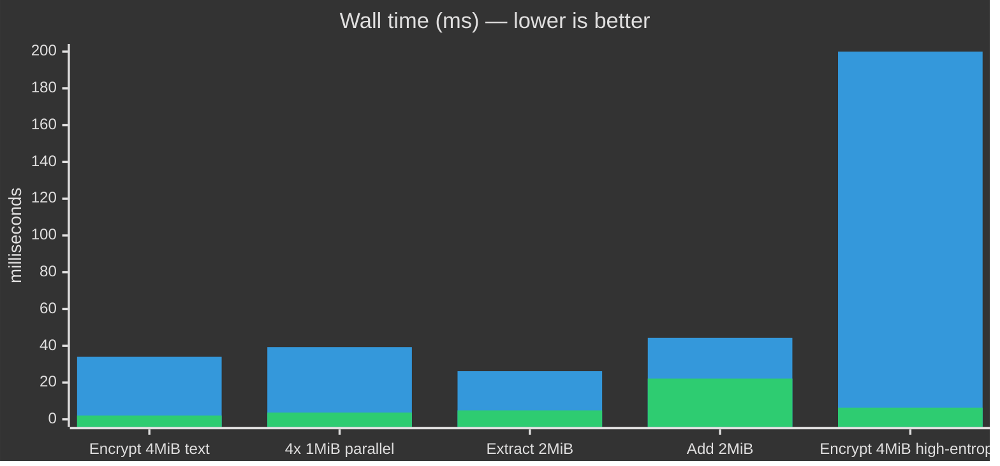

# Pulse-Vault

[](https://github.com/Z3r0s/Pulse-Vault/actions/workflows/test.yml)
[](https://github.com/Z3r0s/Pulse-Vault/releases/latest)
[](CHANGELOG.md)

Official site: [dnspulse.org](https://dnspulse.org)

**[Why Go](docs/WHY_GO.md)** · **[Install](INSTALL.md)** · **[Downloads](docs/DOWNLOADS.md)** · **[Ship it](docs/DISTRIBUTE.md)** · **[Trust / SmartScreen](docs/TRUST.md)** · **[Roadmap](docs/ROADMAP.md)** · **[Changelog](CHANGELOG.md)**

**Pulse-Vault** is a local encrypted file vault from **[DNSPulse](https://dnspulse.org)**. One `.pulsevault` file, offline, password-derived keys, authenticated encryption.

Go GUI + CLI live in [`gui-go/`](gui-go/). The old Python vault is dead (too slow): [legacy/python/](legacy/python/). `pip install pulse-vault` is a **Go binary launcher**, not that archive.

[GitHub Releases](https://github.com/Z3r0s/Pulse-Vault/releases) · [dnspulse.org](https://dnspulse.org) · [INSTALL.md](INSTALL.md) · [DOWNLOADS](docs/DOWNLOADS.md)

## Why Go (not Python, not Rust)

This is a local confidentiality tool. Language choice is the trusted computing base, the packaging attack surface, and whether the UI can encrypt without freezing. Python lost that. Rust is fine for a parser, not for this product. Charts and the full argument: [docs/WHY_GO.md](docs/WHY_GO.md).

Re-run the bench: `cd gui-go && go test ./internal/vault -run TestCompareGoVsArchivedPython -v`

Windows, 2026-08-14, best of 3, same payloads both sides:


```mermaid
%%{init: {"theme": "dark", "xyChart": {"width": 900, "height": 420}} }%%
xychart-beta
    title "Wall time (ms) — lower is better"
    x-axis ["Encrypt 4MiB text", "4x 1MiB parallel", "Extract 2MiB", "Add 2MiB", "Encrypt 4MiB high-entropy"]
    y-axis "milliseconds" 0 --> 200
    bar [34.0, 39.3, 26.2, 44.3, 200]
    bar [2.1, 3.7, 4.9, 22.2, 6.3]
```

High-entropy Python is **1932 ms** (off the chart). Go is **6.3 ms** because we refuse to LZMA a jpeg.

| Workload | Archived Python | Go now | |
| --- | ---: | ---: | --- |
| Encrypt 4 MiB compressible | 34.0 ms | 2.1 ms | **16×** |
| 4× 1 MiB encrypt (Go goroutines / Python one-at-a-time) | 39.3 ms | 3.7 ms | **10.5×** |
| Extract 2 MiB | 26.2 ms | 4.9 ms | **5.3×** |
| Add 2 MiB | 44.3 ms | 22.2 ms | **2×** |
| Encrypt 4 MiB high-entropy (photo/video-like) | 1932 ms | 6.3 ms | **306×** |

| Property | Python (retired) | Rust (not chosen) | Go (what we ship) |
| --- | --- | --- | --- |
| Memory safety | Runtime / GIL, huge interpreter TCB | Affine types, no GC | GC + bounds checks, smaller TCB than CPython |
| Crypto hot path | CPython + C `cryptography` + GIL | Excellent, but you own more of the stack | `x/crypto`, goroutines, one process |
| Cross-compile / supply chain | venv, wheels, PyInstaller | `cargo` + often C deps for GUI | CLI is `CGO_ENABLED=0`. One artifact. |
| UI during KDF / encrypt | Tk loop + threads. Freezes. | More GUI glue | Fyne + work off the UI thread |

**Python** added interpreter / `pip` / PyInstaller attack surface and a GIL on the exact work we want concurrent. **Rust** wouldn't give us a new cipher, and the GUI + release-matrix tax is real. **Go** is one language for vault, CLI, and GUI, with a static CLI and no freezer.

Old Python tree: [`legacy/python/`](legacy/python/). Do not install that folder. Full comparison: [docs/WHY_GO.md](docs/WHY_GO.md).

## Goals

- Keep files private on your machine.
- Hard to peek at, tamper with, or reverse after you lock it.
- Simple enough that a normal person can use it.
- No cloud, no accounts, no telemetry.
- Fast native binary. No Python.

## Features

- Desktop GUI (Go + Fyne): create, open, add, extract, lock, hide in picture.
- CLI (pure Go, no CGO): same operations, plus `open` / `delete` / `info`.
- Hide the vault after a PNG/JPEG/MP4. The picture still opens as a picture.
- Streaming encrypt for big files.
- Scrypt (standard / hardened / fast).
- ChaCha20-Poly1305 then AES-GCM.
- zstd before encrypt (skips junk that won't shrink, like jpgs).
- Offline only.

## Installation

**Windows app:** [Releases](https://github.com/Z3r0s/Pulse-Vault/releases) → `pulse-vault-gui-windows-amd64.exe` → double-click.  
From this repo: double-click [`scripts/install.cmd`](scripts/install.cmd).

```powershell
# Windows CLI from a clone (no env vars). Prefer this over irm|iex.
.\cli.ps1 version
.\scripts\install.ps1
```

```bash
# Linux / macOS CLI  (add --gui for the desktop build when it exists)
curl -fsSL https://raw.githubusercontent.com/Z3r0s/Pulse-Vault/main/scripts/install.sh | sh
```

```bash
pip install -U pulse-vault       # live on PyPI — official Go CLI launcher
go install github.com/Z3r0s/Pulse-Vault/gui-go/cmd/pulse-vault@main
```

Cloned the repo? Don't set any CGO flags:

```powershell
.\cli.ps1 version
```

```bash
./cli.sh version
```

More: **[INSTALL.md](INSTALL.md)**.

## Usage (GUI)

1. Launch `pulse-vault-gui` (or the built binary name on your OS).
2. **Create vault** or **Open vault** from the sidebar.
3. Optional: **Hide in picture** to append the vault after a cover image. Open that picture later to unlock.
4. Enter a strong password (confirm on create).
5. **Add file** / **Extract** while unlocked; **Lock** when done.
6. The vault is a single portable `.pulsevault` file, or a picture that still displays as the cover media.

## Usage (CLI)

```text
pulse-vault                      # visual command card
pulse-vault version
pulse-vault create  <vault.pulsevault> --password <pw> [--profile standard|fast|hardened]
pulse-vault open    <vault.pulsevault> --password <pw>   # interactive console
pulse-vault list    <vault.pulsevault> --password <pw>
pulse-vault add     <vault.pulsevault> --password <pw> <file>
pulse-vault extract <vault.pulsevault> --password <pw> <name> <outdir>
pulse-vault delete  <vault.pulsevault> --password <pw> <name>
pulse-vault info    <vault.pulsevault>
```

Hide the vault after a cover image (the file still opens as a picture):

```text
pulse-vault create hidden.png --carrier cover.png --password <pw>
pulse-vault list hidden.png --password <pw>
pulse-vault add hidden.png --password <pw> secret.txt
pulse-vault info hidden.png
```

CLI has a console look. `--plain` or `NO_COLOR` if you hate color. `open` drops you in a prompt. Pipes just print the file list and quit.

## Documentation

- [Why Go (not Python, not Rust)](docs/WHY_GO.md)
- [Ship it (pip, snap, GitHub Releases)](docs/DISTRIBUTE.md)
- [Roadmap](docs/ROADMAP.md)
- [Installation](INSTALL.md)
- [Go GUI / CLI](gui-go/README.md)
- [Public Go crypto library](gui-go/crypto/README.md)
- [Crypto protocol specification](docs/CRYPTO_PROTOCOL.md)
- [Downloads & Releases](docs/DOWNLOADS.md)
- [Threat Model](docs/THREAT_MODEL.md)
- [Vault Format](docs/VAULT_FORMAT.md)
- [Security Policy](SECURITY.md)

## Reusable Go crypto library

The Pulse-Vault protocol is also available as a public Go package:

```bash
go get github.com/Z3r0s/Pulse-Vault/gui-go/crypto
```

Same format the app uses. Regular ciphers, not a homemade one.

- [Changelog](CHANGELOG.md)
- [Contributing](CONTRIBUTING.md)

## Current Vault Format

- KDF: Scrypt
- File encryption: ChaCha20-Poly1305 followed by AES-GCM
- Compression: zstd (old XZ streams still decrypt)
- Container: ZIP with encrypted metadata and encrypted `data/*.enc` entries
- Current marker: `PULSEVAULT5_COMPRESSED_CASCADE`

## Changelog & Releases

See [CHANGELOG.md](CHANGELOG.md) (Keep a Changelog + SemVer).

**GitHub Releases** is the download area for tagged builds. Pre-1.0 you may see "No releases found" until the first `vX.Y.Z` tag is published.

[View releases →](https://github.com/Z3r0s/Pulse-Vault/releases)

## License

MIT License. Created by [DNSPulse](https://dnspulse.org) / Z3r0s.
