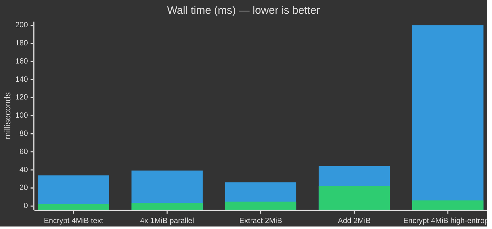

# Pulse-Vault

[](https://github.com/Z3r0s/Pulse-Vault/actions/workflows/test.yml)
[](https://github.com/Z3r0s/Pulse-Vault/releases/latest)
[](CHANGELOG.md)

Official site: [dnspulse.org](https://dnspulse.org)

**Pulse-Vault** is a local encrypted file vault from DNSPulse. One `.pulsevault` file, offline, password-derived keys, authenticated encryption.

Go GUI + CLI live in [`gui-go/`](gui-go/). Python is dead (too slow). Old tree: [legacy/python/](legacy/python/).

Install from source or [GitHub Releases](https://github.com/Z3r0s/Pulse-Vault/releases). Steps: [INSTALL.md](INSTALL.md). Downloads: [docs/DOWNLOADS.md](docs/DOWNLOADS.md). Site: [dnspulse.org](https://dnspulse.org).

## Goals

- Keep files private on your machine.
- Hard to peek at, tamper with, or reverse after you lock it.
- Simple enough that a normal person can use it.
- No cloud, no accounts, no telemetry.
- Fast native binary. No Python.

## Features

- Desktop GUI (Go + Fyne): create, open, add, extract, lock, hide in picture.
- CLI (pure Go, no CGO): same operations, plus `open` / `delete` / `info`.
- Hide the vault after a PNG/JPEG/MP4. The picture still opens as a picture.
- Streaming encrypt for big files.
- Scrypt (standard / hardened / fast).
- ChaCha20-Poly1305 then AES-GCM.
- zstd before encrypt (skips junk that won't shrink, like jpgs).
- Offline only.

## Installation

### Desktop GUI

```powershell
cd gui-go
.\build.ps1          # Go + CGO (MSYS2 mingw64 gcc). No console on double-click.
.\pulse-vault-gui.exe
.\pulse-vault-gui.exe --version
```

```bash
cd gui-go
CGO_ENABLED=1 go build -o pulse-vault-gui .
./pulse-vault-gui --version
```

### CLI (no CGO)

```bash
cd gui-go
go build -o pulse-vault ./cmd/pulse-vault
./pulse-vault version
./pulse-vault create demo.pulsevault --password 'your-strong-password'
./pulse-vault list demo.pulsevault --password 'your-strong-password'
```

See [INSTALL.md](INSTALL.md) and [gui-go/README.md](gui-go/README.md) for platform notes.

## Usage (GUI)

1. Launch `pulse-vault-gui` (or the built binary name on your OS).
2. **Create vault** or **Open vault** from the sidebar.
3. Optional: **Hide in picture** to append the vault after a cover image. Open that picture later to unlock.
4. Enter a strong password (confirm on create).
5. **Add file** / **Extract** while unlocked; **Lock** when done.
6. The vault is a single portable `.pulsevault` file, or a picture that still displays as the cover media.

## Usage (CLI)

```text
pulse-vault                      # visual command card
pulse-vault version
pulse-vault create  <vault.pulsevault> --password <pw> [--profile standard|fast|hardened]
pulse-vault open    <vault.pulsevault> --password <pw>   # interactive console
pulse-vault list    <vault.pulsevault> --password <pw>
pulse-vault add     <vault.pulsevault> --password <pw> <file>
pulse-vault extract <vault.pulsevault> --password <pw> <name> <outdir>
pulse-vault delete  <vault.pulsevault> --password <pw> <name>
pulse-vault info    <vault.pulsevault>
```

Hide the vault after a cover image (the file still opens as a picture):

```text
pulse-vault create hidden.png --carrier cover.png --password <pw>
pulse-vault list hidden.png --password <pw>
pulse-vault add hidden.png --password <pw> secret.txt
pulse-vault info hidden.png
```

CLI has a console look. `--plain` or `NO_COLOR` if you hate color. `open` drops you in a prompt. Pipes just print the file list and quit.

## Documentation

- [Installation](INSTALL.md)
- [Go GUI / CLI](gui-go/README.md)
- [Public Go crypto library](gui-go/crypto/README.md)
- [Crypto protocol specification](docs/CRYPTO_PROTOCOL.md)
- [Downloads & Releases](docs/DOWNLOADS.md)
- [Threat Model](docs/THREAT_MODEL.md)
- [Vault Format](docs/VAULT_FORMAT.md)
- [Security Policy](SECURITY.md)

## Reusable Go crypto library

The Pulse-Vault protocol is also available as a public Go package:

```bash
go get github.com/Z3r0s/Pulse-Vault/gui-go/crypto
```

Same format the app uses. Regular ciphers, not a homemade one.

- [Changelog](CHANGELOG.md)
- [Contributing](CONTRIBUTING.md)

## Current Vault Format

- KDF: Scrypt
- File encryption: ChaCha20-Poly1305 followed by AES-GCM
- Compression: zstd (old XZ streams still decrypt)
- Container: ZIP with encrypted metadata and encrypted `data/*.enc` entries
- Current marker: `PULSEVAULT5_COMPRESSED_CASCADE`

## Why Go (not Python, not Rust)

This is a local confidentiality tool. The threat model is an adversary with the sealed container, not the password: offline ciphertext, brute-force against the KDF, tampering, and (if they get the binary) supply-chain / memory-disclosure questions. Language choice is about the **trusted computing base**, **side-channel surface**, **packaging attack surface**, and whether the UI can do crypto without blocking.

Python lost on all four. The interpreter, `pip`/`PyInstaller`, the GIL, and a Tk event loop are extra moving parts on a path that only needs Scrypt + AEAD + a ZIP frame. Rust is memory-safe and fast, but for *this* product (one static CLI, a Fyne desktop shell, easy Windows/Linux/macOS artifacts, people actually contributing) Go is the better operational fit. We already measured the Python engine vs this Go engine on the same V5 work.

Re-run the bench:

```text
cd gui-go
go test ./internal/vault -run TestCompareGoVsArchivedPython -v
```

Windows, 2026-08-14, best of 3, same payloads both sides:


```mermaid
%%{init: {"theme": "dark", "xyChart": {"width": 900, "height": 420}} }%%
xychart-beta
    title "Wall time (ms) — lower is better"
    x-axis ["Encrypt 4MiB text", "4x 1MiB parallel", "Extract 2MiB", "Add 2MiB", "Encrypt 4MiB high-entropy"]
    y-axis "milliseconds" 0 --> 200
    bar [34.0, 39.3, 26.2, 44.3, 200]
    bar [2.1, 3.7, 4.9, 22.2, 6.3]
```

High-entropy Python is **1932 ms** (off the chart). Go is **6.3 ms** because we refuse to LZMA a jpeg.

| Workload | Archived Python | Go now | |
| --- | ---: | ---: | --- |
| Encrypt 4 MiB compressible | 34.0 ms | 2.1 ms | **16×** |
| 4× 1 MiB encrypt (Go goroutines / Python one-at-a-time) | 39.3 ms | 3.7 ms | **10.5×** |
| Extract 2 MiB | 26.2 ms | 4.9 ms | **5.3×** |
| Add 2 MiB | 44.3 ms | 22.2 ms | **2×** |
| Encrypt 4 MiB high-entropy (photo/video-like) | 1932 ms | 6.3 ms | **306×** |

```text
Python  ████████████████████  encrypt text
Go      █

Python  ██████████████████████  4-way encrypt
Go      █

Python  ██████████████  extract
Go      ██

Python  ████████████████████████  add
Go      ███████████

Python  ████████████████████████████████████████  (1932 ms) high-entropy
Go      █
```

### What that means for security engineering

| Property | Python (retired) | Rust (not chosen) | Go (what we ship) |
| --- | --- | --- | --- |
| Memory safety | Runtime / GIL, huge interpreter TCB | Affine types, no GC | GC + bounds checks, smaller TCB than CPython |
| Crypto hot path | CPython + C `cryptography` + GIL | Excellent, but you own more of the stack | `x/crypto`, goroutines, one process |
| Constant-time / nonce hygiene | Depends on bindings | Easy to get right, easy to over-build | AEAD + random nonces + chunk index in AAD |
| Cross-compile / supply chain | venv, wheels, PyInstaller, AV false positives | `cargo` + often C deps for GUI | CLI is `CGO_ENABLED=0`. One artifact. |
| UI during KDF / stream encrypt | Tk loop + threads. Freezes. | egui/iced/GTK bindings, more glue | Fyne + `fyne.Do`, work off the UI thread |
| Contributor surface | Fast to sketch, slow to harden | Slow compile, steep for desktop | One language for vault, CLI, GUI |

**Python:** interpreter, package index, and a freezer are extra attack surface (dependency confusion, wheel integrity, PyInstaller unpack). The GIL serializes the exact work we want concurrent (KDF + cascade + ZIP rewrite). That's why the GUI died on real vaults.

**Rust:** fine for a kernel-adjacent parser. For Pulse-Vault we'd still need a GUI story, Windows/macOS/Linux release matrix, and people who will patch it. Borrow-checker tax on a ZIP-rewrite + Fyne-equivalent desktop is real. We'd gain no new *cryptographic* primitive — we already use the same class of AEAD/KDF Rust would.

**Go:** memory-safe enough for a userland vault, goroutines so confidentiality work doesn't starve the UI, `trimpath` / `-s -w` / `-buildvcs=false` so the binary doesn't ship your `$HOME` and VCS identity, static CLI with no libc story. That's the stack that stays auditable and shippable.

Old Python tree: [`legacy/python/`](legacy/python/). Don't pip install it.

## Changelog & Releases

See [CHANGELOG.md](CHANGELOG.md) (Keep a Changelog + SemVer).

**GitHub Releases** is the download area for tagged builds. Pre-1.0 you may see "No releases found" until the first `vX.Y.Z` tag is published.

[View releases →](https://github.com/Z3r0s/Pulse-Vault/releases)

## License

MIT License. Created by DNSPulse / Z3r0s.
