# Why Go (not Python, not Rust)

This is a local confidentiality tool. The threat model is an adversary with the sealed container, not the password: offline ciphertext, brute-force against the KDF, tampering, and (if they get the binary) supply-chain / memory-disclosure questions. Language choice is about the **trusted computing base**, **side-channel surface**, **packaging attack surface**, and whether the UI can do crypto without blocking.

Python lost on all four. The interpreter, `pip`/`PyInstaller`, the GIL, and a Tk event loop are extra moving parts on a path that only needs Scrypt + AEAD + a ZIP frame. Rust is memory-safe and fast, but for *this* product (one static CLI, a Fyne desktop shell, easy Windows/Linux/macOS artifacts, people actually contributing) Go is the better operational fit. We already measured the Python engine vs this Go engine on the same V5 work.

Re-run the bench:

```text
cd gui-go
go test ./internal/vault -run TestCompareGoVsArchivedPython -v
```

Windows, 2026-08-14, best of 3, same payloads both sides:

```mermaid
%%{init: {"theme": "dark", "xyChart": {"width": 900, "height": 420}} }%%
xychart-beta
    title "Wall time (ms) — lower is better"
    x-axis ["Encrypt 4MiB text", "4x 1MiB parallel", "Extract 2MiB", "Add 2MiB", "Encrypt 4MiB high-entropy"]
    y-axis "milliseconds" 0 --> 200
    bar [34.0, 39.3, 26.2, 44.3, 200]
    bar [2.1, 3.7, 4.9, 22.2, 6.3]
```



High-entropy Python is **1932 ms** (off the chart). Go is **6.3 ms** because we refuse to LZMA a jpeg.

| Workload | Archived Python | Go now | |
| --- | ---: | ---: | --- |
| Encrypt 4 MiB compressible | 34.0 ms | 2.1 ms | **16×** |
| 4× 1 MiB encrypt (Go goroutines / Python one-at-a-time) | 39.3 ms | 3.7 ms | **10.5×** |
| Extract 2 MiB | 26.2 ms | 4.9 ms | **5.3×** |
| Add 2 MiB | 44.3 ms | 22.2 ms | **2×** |
| Encrypt 4 MiB high-entropy (photo/video-like) | 1932 ms | 6.3 ms | **306×** |

```text
Python  ████████████████████  encrypt text
Go      █

Python  ██████████████████████  4-way encrypt
Go      █

Python  ██████████████  extract
Go      ██

Python  ████████████████████████  add
Go      ███████████

Python  ████████████████████████████████████████  (1932 ms) high-entropy
Go      █
```

## What that means for security engineering

| Property | Python (retired) | Rust (not chosen) | Go (what we ship) |
| --- | --- | --- | --- |
| Memory safety | Runtime / GIL, huge interpreter TCB | Affine types, no GC | GC + bounds checks, smaller TCB than CPython |
| Crypto hot path | CPython + C `cryptography` + GIL | Excellent, but you own more of the stack | `x/crypto`, goroutines, one process |
| Constant-time / nonce hygiene | Depends on bindings | Easy to get right, easy to over-build | AEAD + random nonces + chunk index in AAD |
| Cross-compile / supply chain | venv, wheels, PyInstaller, AV false positives | `cargo` + often C deps for GUI | CLI is `CGO_ENABLED=0`. One artifact. |
| UI during KDF / stream encrypt | Tk loop + threads. Freezes. | egui/iced/GTK bindings, more glue | Fyne + `fyne.Do`, work off the UI thread |
| Contributor surface | Fast to sketch, slow to harden | Slow compile, steep for desktop | One language for vault, CLI, GUI |

**Python:** interpreter, package index, and a freezer are extra attack surface (dependency confusion, wheel integrity, PyInstaller unpack). The GIL serializes the exact work we want concurrent (KDF + cascade + ZIP rewrite). That's why the GUI died on real vaults.

**Rust:** fine for a kernel-adjacent parser. For Pulse-Vault we'd still need a GUI story, Windows/macOS/Linux release matrix, and people who will patch it. Borrow-checker tax on a ZIP-rewrite + Fyne-equivalent desktop is real. We'd gain no new *cryptographic* primitive — we already use the same class of AEAD/KDF Rust would.

**Go:** memory-safe enough for a userland vault, goroutines so confidentiality work doesn't starve the UI, `trimpath` / `-s -w` / `-buildvcs=false` so the binary doesn't ship your `$HOME` and VCS identity, static CLI with no libc story. That's the stack that stays auditable and shippable.

Old Python tree: [`legacy/python/`](../legacy/python/). Don't pip install it.

Back to the [README](../README.md).
