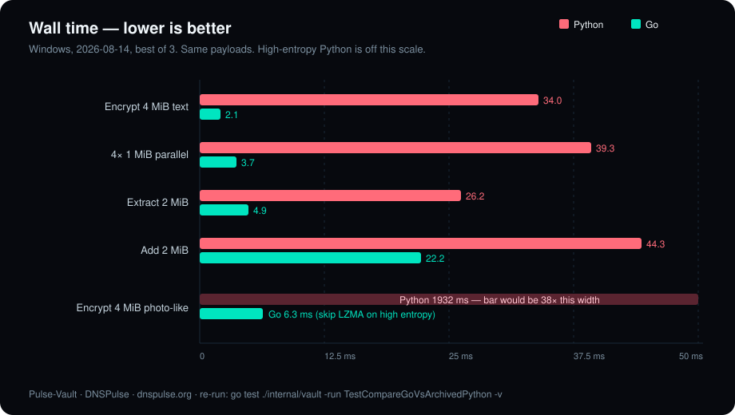
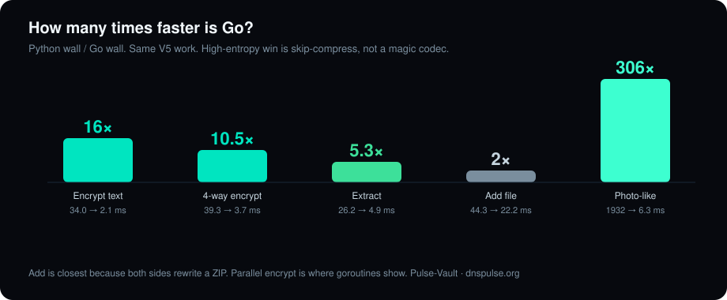
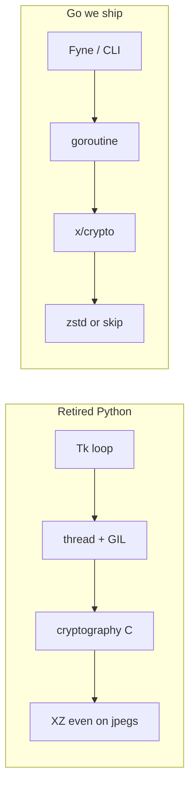
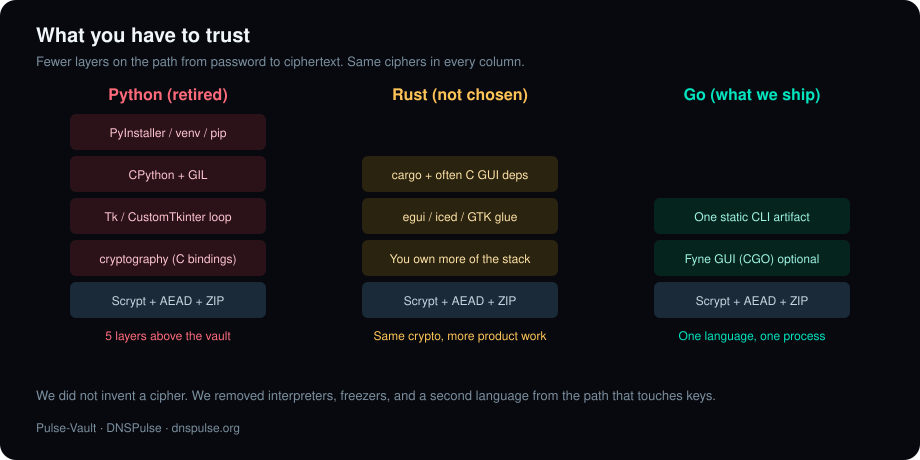
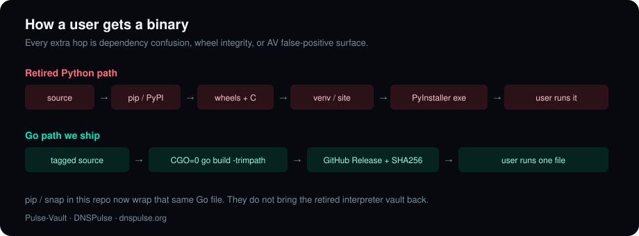
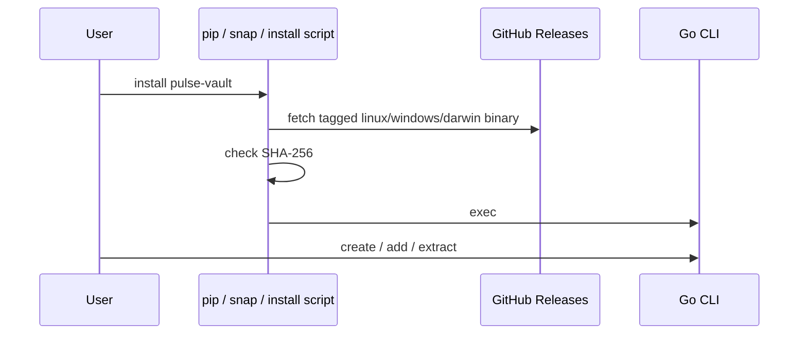

# Why Go (not Python, not Rust)

A product from **[DNSPulse](https://dnspulse.org)**. Source: [github.com/Z3r0s/Pulse-Vault](https://github.com/Z3r0s/Pulse-Vault).

Pulse-Vault is a **local confidentiality tool**. The adversary we design for has the sealed container and not the password: offline ciphertext, brute-force against the KDF, tampering, and (if they get the binary) supply-chain and memory-disclosure questions.

Language choice is not a taste poll. It is the **trusted computing base**, the **side-channel surface**, the **packaging attack surface**, and whether the UI can derive a key and stream AEAD **without blocking**.

Python lost on all four. Rust is memory-safe and fast, but for *this* product — one static CLI, a Fyne desktop shell, Windows/Linux/macOS artifacts, people who will actually patch it — Go is the operational fit. We measured the archived Python engine against this Go engine on the same V5 work.

Re-run the bench:

```text
cd gui-go
go test ./internal/vault -run TestCompareGoVsArchivedPython -v
```

Windows, 2026-08-14, best of 3, same payloads both sides.

## What we measured



High-entropy Python is **1932 ms**. Go is **6.3 ms** because we refuse to LZMA a jpeg. That is an engineering choice (entropy sniff → compress flag 0), not a claim that Go’s compressor is 300× better.

| Workload | Archived Python | Go now | |
| --- | ---: | ---: | --- |
| Encrypt 4 MiB compressible | 34.0 ms | 2.1 ms | **16×** |
| 4× 1 MiB encrypt (Go goroutines / Python one-at-a-time) | 39.3 ms | 3.7 ms | **10.5×** |
| Extract 2 MiB | 26.2 ms | 4.9 ms | **5.3×** |
| Add 2 MiB | 44.3 ms | 22.2 ms | **2×** |
| Encrypt 4 MiB high-entropy (photo/video-like) | 1932 ms | 6.3 ms | **306×** |



Add is the closest race because both sides rewrite a ZIP. Parallel encrypt is where goroutines show. Scrypt cost is the same on both (`fast` profile in the bench so the test finishes); we are not claiming a KDF win.



## Security engineering, not language fandom



| Property | Python (retired) | Rust (not chosen) | Go (what we ship) |
| --- | --- | --- | --- |
| Memory safety | Runtime / GIL, huge interpreter TCB | Affine types, no GC | GC + bounds checks, smaller TCB than CPython |
| Crypto hot path | CPython + C `cryptography` + GIL | Excellent, but you own more of the stack | `x/crypto`, goroutines, one process |
| Constant-time / nonce hygiene | Depends on bindings | Easy to get right, easy to over-build | AEAD + random nonces + chunk index in AAD |
| Cross-compile / supply chain | venv, wheels, PyInstaller, AV false positives | `cargo` + often C deps for GUI | CLI is `CGO_ENABLED=0`. One artifact. |
| UI during KDF / stream encrypt | Tk loop + threads. Freezes. | egui/iced/GTK bindings, more glue | Fyne + `fyne.Do`, work off the UI thread |
| Contributor surface | Fast to sketch, slow to harden | Slow compile, steep for desktop | One language for vault, CLI, GUI |

**Python:** interpreter, package index, and a freezer are extra attack surface (dependency confusion, wheel integrity, PyInstaller unpack). The GIL serializes the exact work we want concurrent (KDF + cascade + ZIP rewrite). That is why the GUI died on real vaults.

**Rust:** fine for a kernel-adjacent parser. For Pulse-Vault we would still need a GUI story, a Windows/macOS/Linux release matrix, and people who will patch it. Borrow-checker tax on a ZIP-rewrite + Fyne-equivalent desktop is real. We would gain no new *cryptographic* primitive — we already use the same class of AEAD/KDF Rust would.

**Go:** memory-safe enough for a userland vault, goroutines so confidentiality work does not starve the UI, `trimpath` / `-s -w` / `-buildvcs=false` so the binary does not ship your `$HOME` and VCS identity, static CLI with no libc story. That is the stack that stays auditable and shippable.

## Supply chain



A confidentiality tool should be boring to fetch.

- **GitHub Release:** one file + `SHA256SUMS`. That is the source of truth.
- **pip / snap** in this repo wrap **that same Go CLI**. They do not reimplement the vault in Python.
- We do **not** ask anyone to `pip install` the tree under [`legacy/python/`](../legacy/python/). That tree is an archive.



## What we are not claiming

- Go is not “more encrypted” than Rust. Same Scrypt, same ChaCha20-Poly1305, same AES-GCM.
- 50 GB will not become 2 MB unless the data is almost empty or almost all repeats. Lossless compression has a floor.
- GC does not make a vault immune to memory disclosure. Lock the vault. Do not screenshot the unlocked list.
- Fyne GUI still needs CGO. The CLI does not. That split is intentional.

## How this shows up in the product

- Format stays V5 (`PULSEVAULT5_COMPRESSED_CASCADE`). Old XZ streams still decrypt.
- New writes use zstd or skip. Photos and video-like blobs skip.
- ZIP members store the basename only. Timestamps are zeroed.
- Hide-in-picture appends the ZIP after the cover media. The file still opens as a picture.

Old Python tree: [`legacy/python/`](../legacy/python/). Do not pip-install that folder.

More direction for the product: [ROADMAP.md](ROADMAP.md). How to ship pip / snap / GitHub Releases: [DISTRIBUTE.md](DISTRIBUTE.md).

Back to the [README](../README.md). Site: [dnspulse.org](https://dnspulse.org).
